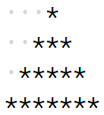

# Q1. Code : Inverted Number Pattern
Send Feedback
Print the following pattern for the given N number of rows.
Pattern for N = 4
```
4444
333
22
1
```
Input format :
```
Integer N (Total no. of rows)
```
Output format :
```
Pattern in N lines
```
Constraints :
```
0 <= N <= 50
```
Sample Input 1:
```
5
```
Sample Output 1:
```
55555 
4444
333
22
1
```
Sample Input 2:
```
6
```
Sample Output 2:
```
666666
55555 
4444
333
22
1
```

# Q2. Code : Mirror Number Pattern
Send Feedback
Print the following pattern for the given N number of rows.
Pattern for N = 4
```
...1
..12
.123
1234
```
The dots represent spaces.

Input format :
```
Integer N (Total no. of rows)
```
Output format :
```
Pattern in N lines
```
Constraints
```
0 <= N <= 50
```
Sample Input 1:
```
3
```
Sample Output 1:
```
   1 
 12
123
```
Sample Input 2:
```
4
```
Sample Output 2:
```
   1 
  12
 123
1234
```

# Q3. Code : Star Pattern
Send Feedback
Print the following pattern
Pattern for N = 4
<br>


The dots represent spaces.


Input Format :
N (Total no. of rows)
Output Format :
Pattern in N lines
Constraints :
0 <= N <= 50
Sample Input 1 :
3
Sample Output 1 :
   *
  *** 
 *****
Sample Input 2 :
4
Sample Output 2 :
    *
   *** 
  *****
 *******